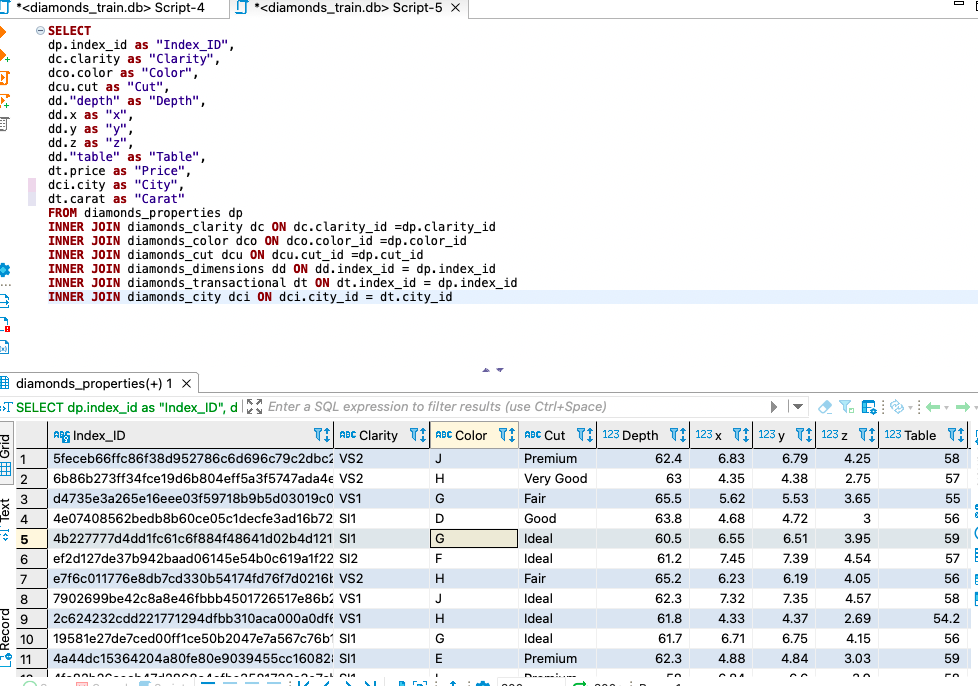

# The Diamond Price teller 

### :raising_hand: **Hello and welcome to the diamond price teller** 
In this repository I am going to share and explain how I have faced the challenge of prediction of diamond prices in the kaggle competition of Ironhack: https://www.kaggle.com/competitions/dataptmad1121/leaderboard.

The goal is simple, find the best model that will predict the prices of a dataset of diamonds based on the already available data.

### :bookmark_tabs: **Step1: Data available**
The data provided in the competition has been:  to train your model and a detailed description of the features.

<ol>
  <li>diamonds_train.db - the training set</li>
  <li>diamonds_test.csv - the test set</li>
  <li>sample_submission.csv - a sample submission file in the correct format.</li>
  <li>Fourth item</li>
</ol>

This data can be found under the data folder. 
In order to read the diamonds_train and obtain the diamonds_train.csv that will be read from the notebooks afterwards, DBeaver has been used 

### :running: **Step 2: **