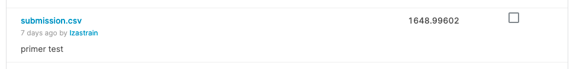
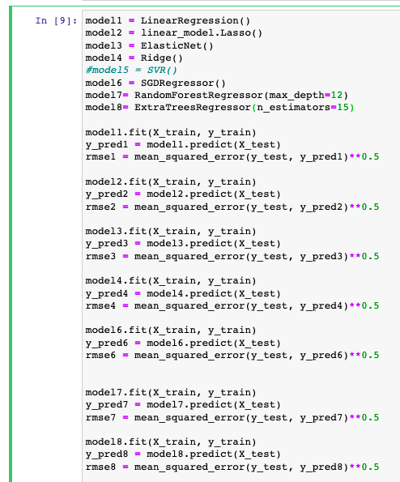

# The Diamond Price teller 

<p align="center"></p>


### :raising_hand: **Hello and welcome to the diamond price teller** 
In this repository I am going to share and explain how I have faced the challenge of prediction of diamond prices in the kaggle competition of Ironhack: https://www.kaggle.com/competitions/dataptmad1121/leaderboard.

The goal is simple, find the best model that will predict the prices of a dataset of diamonds based on the already available data.


### :bookmark_tabs: **Step1: Data available**
The data provided in the competition has been: 

<ol>
  <li>diamonds_train.db - the training set</li>
  <li>diamonds_test.csv - the test set</li>
  <li>sample_submission.csv - a sample submission file in the correct format.</li>
  <li>Fourth item</li>
</ol>

This data can be found under the data folder. 

In order to read the diamonds_train and obtain the diamonds_train.csv that will be read from the notebooks afterwards, DBeaver has been used 

<p align="center"></p>


### :running: **Step 2: **First attempt or keeping things simple

In order to understand the baseline, I started testing the first most simple estimation possible: 
- Model: LinearRegression 
- Categorical variables transformed to numerical ones via pd.get_dummies
- Scaled the data using scaler.fit_transform

The steps followed are detailed in notebook  :page_with_curl: 1_First_attempt under :open_file_folder:notebook folder. 

And just like that :tada::

<p align="center"></p>


### :surfer: **Step 3: **Different models - winner RandomForestRegressonr

The next thing I did was to test different models and evaluate the impact it had on my error calculated as rmse: 

*Models tested* 

model1 = LinearRegression()
model2 = linear_model.Lasso()
model3 = ElasticNet()
model4 = Ridge()
model5 = SVR()
model6 = SGDRegressor()
model7= RandomForestRegressor(max_depth=12)
model8= ExtraTreesRegressor(n_estimators=15)


Also, *hyperparams* where also modified on a different range of values as max_depth or n_estimators

<p align="center"></p>

The steps followed are detailed in notebook  :page_with_curl: 2_Different_models under :open_file_folder:notebook folder. 

And just like that:bomb::

<p align="center"></p>

The difference was almost none and in some cases the error even increased. 
I decided to move on using the model that reduced to the maximum my error, from a value of aprox 1600 to 1200: :purple_heart: *RandomForestRegressor* :purple_heart:


### :hammer: **Step 4: **Data cleaning 

Following the model selection, a common step to take is to analyse the data to remove outliers, values that do not make sense or values that are repeating the same information (very high correlation). 

Some of the data cleaning I tested:

- Remove highly correlated features: x,y,z 
- Plot different combination of features and manually remove outliers

The steps followed are detailed in notebook  :page_with_curl: 3_Data_cleaning under :open_file_folder:notebook folder. 


```
The sad truth was that the estimations were worse which made me realise that I was facing an *underfitting model*. 
Therefore, I decided to move to add new features creating new realationships that might make more robust my estimation model.
        
```


